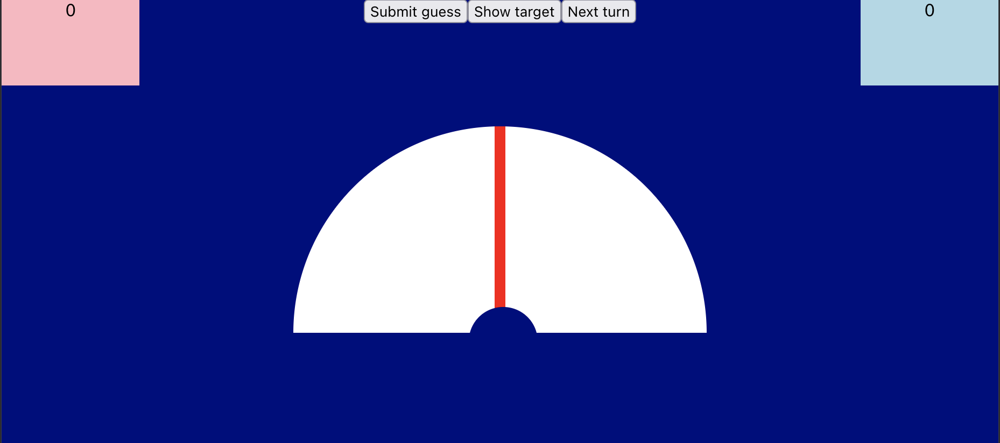
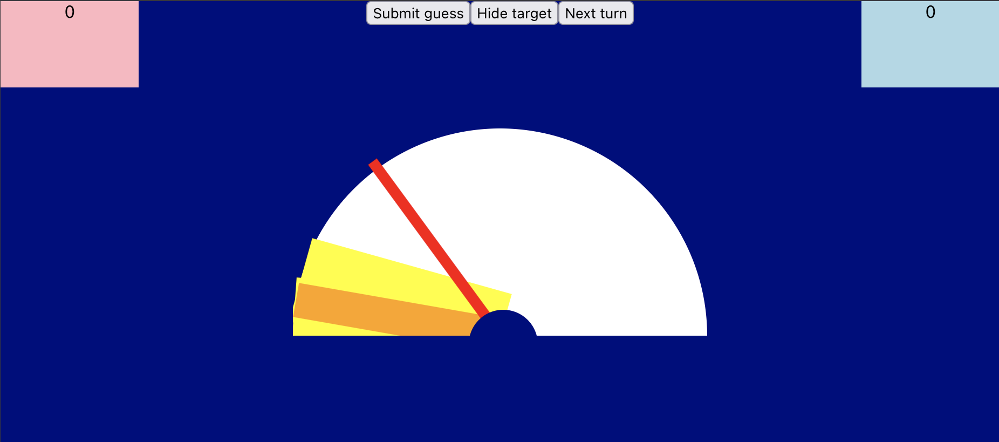
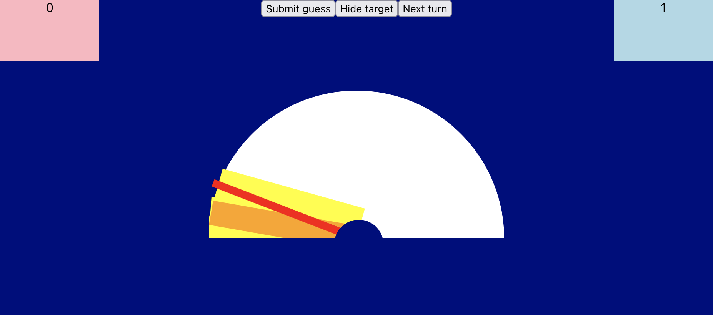

# Tide Extent Game

## How To Play

### 1. "Clue Giver" Provides a Hint

- There are two teams, and each turn the active team elects a member to give a clue.
- The clue giver checks where the target zones are by clicking the **"Show target" button** while the others look away.
  - The target zone (orange) dictates the angle at which the other members must move the pointer to.
- After hiding the target zone by clicking the **"Hide target" button**, the clue giver announces what the scale is for the gauge (e.g. on a scale from "Cold" to "Hot")
  - Then, a hint is provided that gives the team an idea of where the target zone would be along the scale (e.g. "Ice Cream")

### 2. Rest of Team Guesses Where the Target Zone is

- Given the scale and hint, the team moves the red pointer by clicking the screen at where on the gauge they believe the target zone is.
- Once the pointer's location is decided and agreed upon, the team verifies by clicking the **"Submit guess" button**.
- After submission, points are given based on how close to the target zone the pointer is.
  - If in the orange (target) zone, two points are added to the team's score. One point is added if in the yellow zone.

### 3. End Turn

- Once the points are allocated, the next team can start their turn with a new target zone by clicking the **"End turn" button**.
